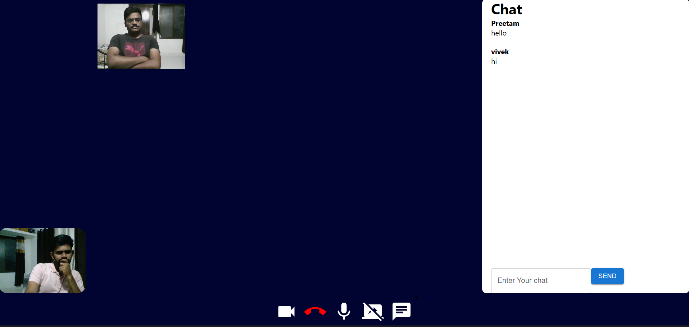

# 💬 Meet-X — Real-Time Video Conferencing App  

> **A powerful, full-stack video calling platform built with React, WebRTC, and Socket.io — inspired by Google Meet.**  
> Connect, collaborate, and communicate with ease — all in your browser.

---

## 🌐 Live Demo / Deployment

👉 **Try it here:** [https://meet-x-video-call.vercel.app](https://meet-x-video-call.vercel.app)  
🔗 **Backend API:** [https://meetx-0y6k.onrender.com](https://meetx-0y6k.onrender.com)

---

## 🧠 Project Overview  

**Meet-X** is a real-time video conferencing web app that lets users:
- Register/login securely  
- Host or join virtual meetings instantly  
- Chat, share screens, and collaborate seamlessly  

It’s built using **MERN Stack + WebRTC + Socket.io** and showcases how **peer-to-peer communication** works on the web.  
Perfect for **remote teams, classrooms, or portfolio demonstrations**.  

---

## 🖼️ Project Demo Images / GIFs  

| Landing Page | Video Call |
|------------|-------------|
|  |  | !

---

## ✨ Features  

✅ **User Authentication** — Secure login & signup using JWT tokens  
✅ **Dashboard** — View or join meeting rooms  
✅ **Meeting History** — Track previous meeting codes  
✅ **Real-Time Video & Audio** — WebRTC peer-to-peer streaming  
✅ **Screen Sharing** — Share your screen instantly  
✅ **In-Meeting Chat** — Live chat during video calls  
✅ **Responsive UI** — Works on both desktop and mobile  
✅ **Guest Access** — Join meetings without login  
✅ **Logout System** — Token-based session handling  
✅ **MongoDB Integration** — Persistent meeting logs  

---

## 🧰 Tech Stack  

### 🖥️ Frontend  

### ⚙️ Backend  

### 🗄️ Database  

### ☁️ Deployment  

---

# 🚧 Future Goals

## 🚀 Feature Additions

### 🧠 AI-based meeting transcription & chat summarization

### 📅 Schedule meetings and send invites

### 💬 Add emoji reactions in chat

### 🖼️ Virtual backgrounds with TensorFlow.js

## 🧩 Technical Improvements

### 📈 Migrate to JWT Auth for token validation

### 🧰 Add CI/CD pipeline using GitHub Actions

### 🏗️ Scale backend with Docker + NGINX

### 💾 Optimize MongoDB queries and indexing
